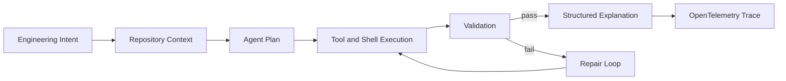

# AGENTS.md

Repository-level instructions and operational guidance for AI coding agents working on n7n.

n7n is an AI-native workflow orchestration platform for software engineering and DevOps workflows. It is a fork of n8n, but its project identity is Codex-first, provider-agnostic, AI-agent-native, and engineering-workflow-oriented.

This file is for Codex, OpenAI agents, future AI coding systems, and multi-agent orchestration. Do not introduce Claude-specific workflow assumptions, Claude-only abstractions, or Anthropic-only architecture unless you are working on an explicit Anthropic provider integration.

## Project Overview

n7n extends workflow automation into AI-assisted autonomous engineering systems.

Core product direction:

- AI-native software engineering workflows
- Codex-style agent orchestration
- Validation and repair loops
- Repository-aware automation
- Observable AI execution systems
- Human approval gates for high-impact engineering operations

The product should feel like AI-native engineering infrastructure, not a chatbot wrapper, prompt UI, or generic automation platform.

## Architecture

The fork keeps the n8n monorepo structure and workflow engine foundation:

- `packages/workflow`: Core workflow interfaces, graph traversal, and execution types
- `packages/core`: Workflow execution engine primitives
- `packages/cli`: Backend API, controllers, services, repositories, and runtime modules
- `packages/frontend/editor-ui`: Vue 3 workflow editor
- `packages/frontend/@n8n/i18n`: UI copy and translations
- `packages/nodes-base`: Built-in workflow nodes, including n7n engineering nodes
- `packages/@n8n/api-types`: Shared frontend/backend API types
- `packages/@n8n/instance-ai`: AI assistant backend capabilities
- `packages/@n8n/ai-workflow-builder.ee`: AI workflow builder package

n7n-specific AI execution should be designed around these layers:

1. Workflow Engine
2. AI Agent Layer
3. Validation Layer
4. Repair Loop System
5. Context Engineering Layer
6. Repository Analysis Layer
7. Observability and OpenTelemetry Layer
8. Human Approval Layer

The workflow graph is the control plane. Agent behavior must be explicit, observable, bounded, and represented as workflow execution data.

## Agent Architecture Principles

- Keep providers swappable. Support Codex/OpenAI first, but do not hardcode the architecture to one vendor.
- Model providers are adapters. Agent planning, validation, repair, context selection, and tracing belong in reusable n7n abstractions.
- Prefer structured outputs over prose-only responses.
- Prefer typed contracts, schemas, and discriminated unions over untyped JSON blobs.
- Keep tool execution explicit and auditable.
- Make retries bounded by count, time, cost, and approval policy.
- Treat repository context as engineered input, not a full-repo dump.
- Emit telemetry for prompts, tool calls, shell commands, token usage, latency, retries, failures, artifacts, and repair attempts.

## Codex Execution Model

Codex-oriented nodes and services should support:

- Task planning
- Code generation
- Shell execution
- Repository analysis
- Validation execution
- Retry on failure
- Structured reasoning output
- Confidence reporting
- Artifact generation
- Tool-call history
- OpenTelemetry span metadata

Do not use Codex as simple text completion. Codex workflows should be iterative systems that plan, act, validate, repair, and explain.

## Workflow Rules

AI engineering workflows should follow this shape unless a narrower task clearly does not need it:



Required workflow properties:

- Each agent step has typed inputs and outputs.
- Each shell/tool execution records command, status, duration, stdout/stderr summary, and artifacts.
- Validation failures are machine-readable and can be routed back into repair loops.
- Human approval is required before merging, deploying, deleting, rotating credentials, or changing production systems.
- OpenTelemetry spans correlate workflow, node, agent, validation, repair, and approval events.

## Advanced Workflow Examples

### Autonomous PR Review

- Fetch PR
- Analyze repository context
- Run Codex review
- Execute Ruff
- Execute mypy
- Execute pytest
- Generate remediation suggestions
- Open GitHub comments behind approval policy
- Generate OpenTelemetry traces

### Kubernetes Incident Investigation

- Gather logs
- Gather traces
- Summarize failures
- Identify bottlenecks
- Propose fixes
- Generate infrastructure patch suggestions
- Request approval before applying changes

### AWS Deployment Workflow

- Analyze FastAPI repository
- Generate deployment plan
- Validate Docker setup
- Generate Terraform updates
- Deploy to ECS behind approval policy
- Validate health checks
- Trace deployment lifecycle

## TypeScript Standards

- Never use `any`; use proper types or `unknown`.
- Avoid `as` casting outside tests; prefer type guards, predicates, and schema parsing.
- Define shared frontend/backend API contracts in `packages/@n8n/api-types`.
- Use Zod for runtime validation where external inputs, model outputs, or tool outputs cross trust boundaries.
- Lazy-load heavy modules that are only used in specific execution paths.
- Keep node/service abstractions narrow and composable.

## Backend Patterns

- Follow controller -> service -> repository boundaries in `packages/cli`.
- Use dependency injection via `@n8n/di`.
- Use configuration from `@n8n/config`.
- Use `UnexpectedError`, `OperationalError`, or `UserError` where appropriate. Do not introduce deprecated `ApplicationError` usage.
- Every authenticated REST endpoint must have project or global scope decorators.

## Frontend Patterns

- Refer to `packages/frontend/AGENTS.md` for frontend-specific guidance.
- All UI text must use i18n from `packages/frontend/@n8n/i18n`.
- Keep the initial n7n frontend surface minimal. Prioritize backend execution and structured outputs first.
- Use design-system components and tokens; do not hardcode spacing or colors.
- Use a single stable `data-testid` value where E2E coverage needs selectors.

## Testing Requirements

- Always use pnpm.
- Run tests from the package directory when targeting a specific package.
- Use Jest for backend/node unit tests and Vitest for frontend unit tests.
- Use Playwright for E2E tests.
- Mock external dependencies in unit tests.
- Prefer hoisted typed mocks when immutable fixtures are reused across tests.
- Run typecheck before committing.

Useful commands:

```bash
pnpm build > build.log 2>&1
pnpm typecheck
pnpm lint
pnpm test
pnpm test:affected
```

Package-level checks are preferred while iterating. Run full-repo checks before final PRs.

## Observability Expectations

AI workflows must be observable by default.

Instrument:

- Prompt execution
- Token usage
- Model/provider metadata
- Retries
- Validation failures
- Tool calls
- Shell execution
- Repository analysis stages
- Workflow execution graphs
- Repair loop attempts
- Human approval decisions

Use OpenTelemetry spans and structured logs. Span relationships should connect workflow execution, node execution, agent planning, tool calls, validation, repair, and final artifacts.

## Security Constraints

- Do not leak secrets into prompts, logs, traces, workflow JSON, screenshots, or generated artifacts.
- Redact credentials and tokens before sending context to model providers.
- Treat repository files, logs, traces, and shell output as potentially sensitive.
- Do not apply production changes without explicit human approval.
- Security fixes must use neutral branch names, commit messages, PR titles, test names, and comments.
- Do not expose vulnerability classes or attack vectors in public artifacts.

## Validation Loops

Validation is part of AI execution, not an afterthought.

Codex-style workflows should:

- Generate or modify artifacts
- Run validators such as Ruff, pytest, mypy, builds, type checks, or custom commands
- Parse validation results into structured data
- Feed concise failure context back into repair prompts
- Retry within bounded policies
- Stop and request human review when cost, risk, or retry limits are reached

## Engineering Conventions

- Keep changes scoped to the requested feature.
- Prefer existing n8n/n7n patterns over new abstractions.
- Use workflow traversal utilities from `n8n-workflow` instead of custom graph traversal.
- Preserve provider-agnostic boundaries.
- Do not add Claude-specific files, examples, prompts, or product copy.
- Use Codex-first wording for n7n engineering workflow examples.
- Preserve support for other providers through adapter interfaces where needed.

## Documentation

- Use Mermaid diagrams when visualizing architecture or workflows.
- Keep docs aligned with the n7n identity in `README.md`, `docs/architecture.md`, `docs/vision.md`, and `docs/roadmap.md`.
- Use `AGENTS.md` for agent instructions. Do not add new `CLAUDE.md` files.

## Pull Requests

- Follow `.github/pull_request_template.md`.
- Follow `.github/pull_request_title_conventions.md`.
- Use draft PRs while work is incomplete.
- Reference Linear tickets as `https://linear.app/n8n/issue/[TICKET-ID]` when relevant.
- Link GitHub issues mentioned in Linear tickets.
