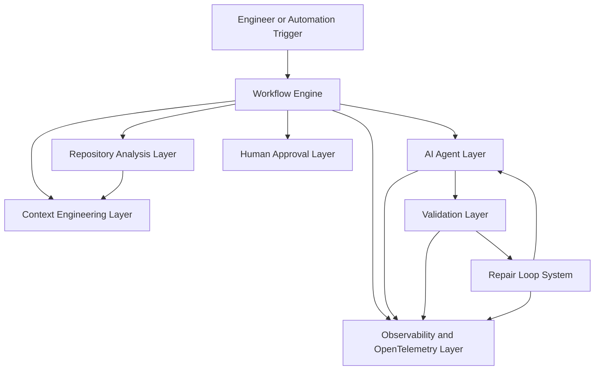
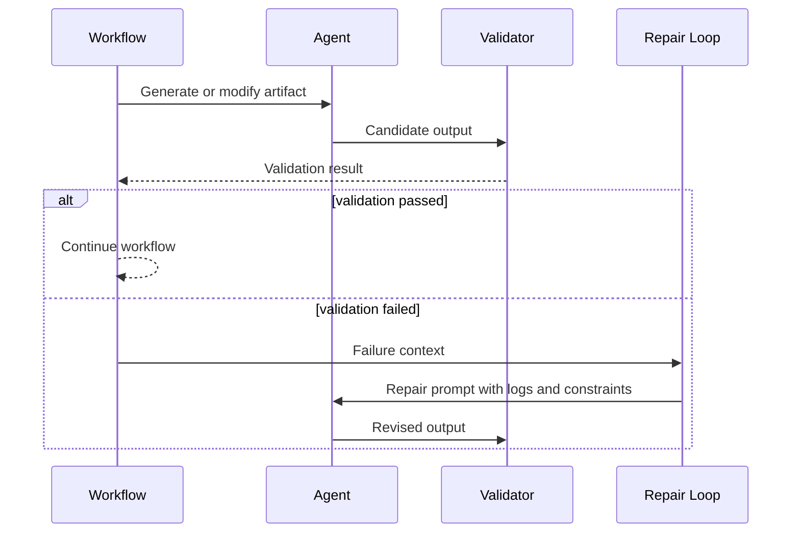
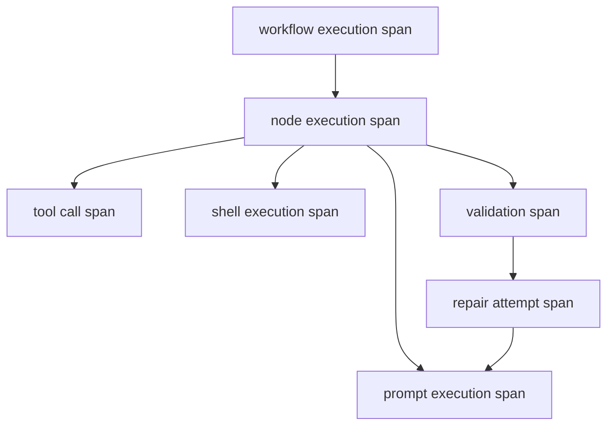
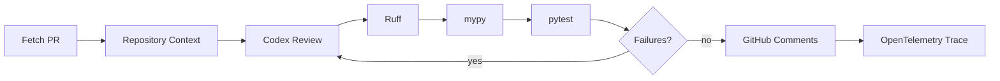
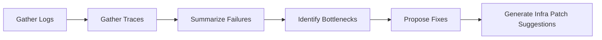
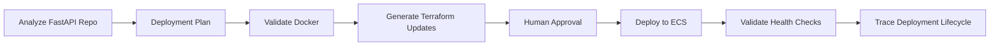

# n7n Architecture

n7n extends the n8n workflow model with AI-native engineering orchestration. The workflow graph remains the durable control plane, while Codex-style agent execution, repository context, validation, repair, and observability become explicit runtime layers.

n7n is Codex-first and provider-agnostic. OpenAI/Codex is the default orientation for engineering workflows, but model providers must be implemented as adapters behind reusable agent, validation, repair, context, and telemetry abstractions.

## 1. Workflow Engine

The workflow engine is the orchestration backbone inherited from n8n. It is responsible for graph execution, node scheduling, input and output routing, credentials, retries, and workflow persistence.

In n7n, the workflow engine should remain deterministic where determinism matters. AI behavior is modeled as explicit nodes and execution spans so that generated decisions can be reviewed, replayed, and constrained.

Responsibilities:

- Execute node graphs
- Route structured data between nodes
- Persist workflow definitions and executions
- Support manual, scheduled, webhook, and programmatic triggers
- Provide the durable boundary for agentic work

## 2. AI Agent Layer

The AI Agent Layer runs coding agents and LLM workflows as workflow participants. It should not be tied to one model provider. Providers, tools, prompts, context sources, and safety policies should be swappable.

Codex-style execution is the primary design target: agents plan, call tools, execute shell commands, inspect repositories, run validations, repair failures, produce artifacts, report confidence, and emit structured traces.

Responsibilities:

- Execute Codex-style engineering tasks
- Generate workflow JSON from engineering intent
- Produce implementation plans and code changes
- Consume repository context and validation feedback
- Emit structured reasoning summaries, tool calls, token usage, and model metadata

Expected execution contract:

- `plan`: task decomposition, risk assessment, validation strategy, approval requirements
- `act`: tool calls, shell commands, code generation, artifact generation
- `validate`: command results, test output, lint/type errors, health checks
- `repair`: bounded retries using validation feedback
- `explain`: structured summary, confidence, changed files, artifacts, residual risks
- `trace`: OpenTelemetry spans for prompt execution, tool calls, shell execution, validations, retries, and artifacts

## 3. Validation Layer

The Validation Layer turns engineering quality checks into first-class workflow steps.

Initial validators include:

- Ruff
- pytest
- mypy
- Build commands
- Type checks
- Custom repository commands
- Policy checks

Validators must emit structured results rather than plain logs only. A validation output should include status, command, exit code, duration, summary, relevant log excerpts, and repair hints where possible.

## 4. Repair Loop System

Repair loops connect failed validation back to agents. Instead of treating a failed node as the end of a workflow, n7n can route failure context into a bounded retry loop.

Responsibilities:

- Bound retries by count, time, and cost
- Preserve validation history
- Feed concise failure context back to agents
- Stop when approval, risk, or budget policies require human input
- Make repair behavior observable

## 5. Context Engineering Layer

The Context Engineering Layer decides what an agent needs to know before acting. It should optimize for relevance, cost, privacy, and repeatability.

Responsibilities:

- Build task-specific context packs
- Compress repository and execution context
- Select relevant files, logs, traces, tests, and configuration
- Track provenance for included context
- Avoid sending unnecessary secrets or unrelated files to model providers

## 6. Repository Analysis Layer

The Repository Analysis Layer gives workflows semantic awareness of a codebase.

Responsibilities:

- Detect languages, frameworks, package managers, and test tools
- Extract dependency graphs
- Identify relevant files for a task
- Summarize architecture and ownership boundaries
- Inspect pull requests and changed files
- Produce context inputs for agents and validators

The repository layer should prefer structured parsers and package metadata where available, falling back to text analysis only when necessary.

## 7. Observability and OpenTelemetry Layer

AI-native workflows must be observable by default. n7n should emit OpenTelemetry traces and structured logs for workflow execution, node execution, agent steps, validation checks, repair attempts, token usage, latency, and failures.

Responsibilities:

- Emit workflow, node, agent, validator, and repair spans
- Track token usage, model latency, retries, and failure causes
- Export traces through OpenTelemetry exporters
- Support trace visualization in the editor
- Correlate generated artifacts with execution spans

Span relationships should make the execution graph inspectable:

## 8. Human Approval Layer

Autonomous engineering workflows need explicit human control points for risky actions.

Responsibilities:

- Require approval before merging, deploying, deleting, rotating credentials, or changing production systems
- Show the proposed action, context, validation result, and trace summary
- Allow approval, rejection, edits, or rerouting
- Preserve audit history

## Design Principles

- The workflow graph is the source of truth.
- AI decisions are explicit workflow events, not hidden side effects.
- Validation is part of generation, not a separate afterthought.
- Repair loops are bounded and observable.
- Context is engineered, not dumped.
- Provider abstractions must avoid lock-in to a single model vendor.
- Human approval gates protect high-impact operations without blocking low-risk iteration.

## Advanced Workflow Shapes

### Autonomous PR Review

### Kubernetes Incident Investigation

### AWS Deployment Workflow

